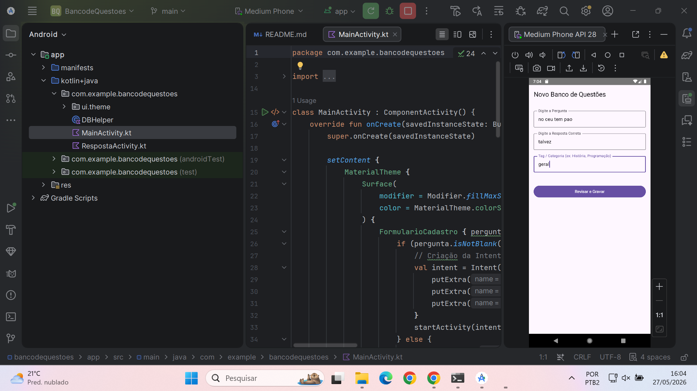
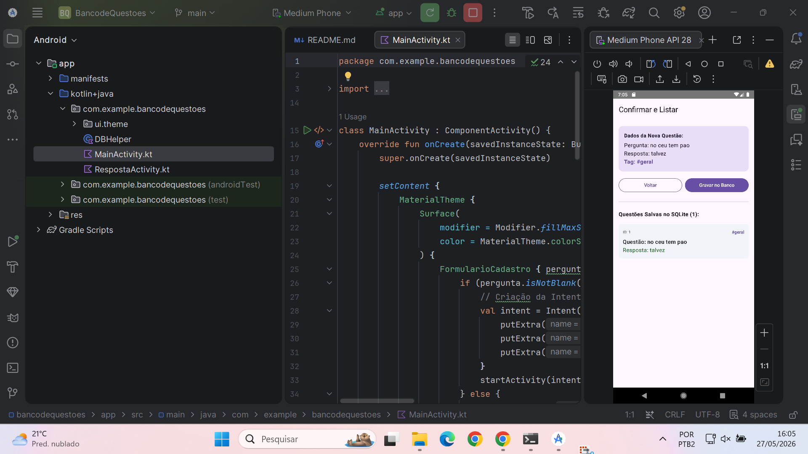

# Banco de Questões

Este projeto consiste em um aplicativo Android nativo voltado para o gerenciamento, categorização por tags e persistência local de perguntas e respostas. A solução foi desenvolvida utilizando **Jetpack Compose** para a construção de uma interface de usuário reativa, moderna e declarativa, integrada ao ecossistema de armazenamento do **SQLite nativo** por meio da API SQLiteOpenHelper.

O projeto baseou-se nas diretrizes de arquitetura multi-atividades e controle de dados locais estabelecidas em documentação de revisão técnica, adaptando fluxos legados baseados em arquivos XML tradicionais para componentes modernos do Jetpack Compose.

---

## 📱 Interface do Aplicativo

Abaixo estão as capturas de tela demonstrando o fluxo operacional e o design responsivo construído em Material Design 3 com o Jetpack Compose:

*Figura 1: Tela de inserção de dados (MainActivity).*

*Figura 2: Tela de validação e exibição dos registros armazenados no SQLite Nativo (RespostaActivity).*

---

## 🚀 Funcionalidades

* **Formulário de Entrada Declarativo:** Captura detalhada de perguntas, respostas corretas e etiquetas (tags) estruturais para classificação.
* **Navegação Segura via Intents:** Transferência explícita de dados estruturados entre diferentes ciclos de vida de atividades (MainActivity para RespostaActivity).
* **Persistência Local (SQLite Nativo):** Escrita e leitura diretamente no armazenamento interno do dispositivo utilizando transações SQL puras, sem dependências de ORMs pesados.
* **Consulta em Tempo Real:** Listagem dinâmica das questões cadastradas organizada por meio de listas indexadas (LazyColumn) que refletem imediatamente o estado do banco de dados.

---

## 📂 Estrutura Arquitetural do Código

O projeto está organizado sob o pacote principal com.example.bancodequestoes, dividindo-se em componentes de interface e a camada de dados:

com.example.bancodequestoes/
│
├── db/
│   └── DBHelper.kt           # Camada de Dados: Gerenciamento do SQLite (Criação, Inserção e Consulta)
│
├── MainActivity.kt           # Camada de Visão: Formulário de captação de dados em Jetpack Compose
└── RespostaActivity.kt       # Camada de Visão: Validação, gravação e exibição dos registros em tempo real

---

## 🛠️ Descrição Detalhada dos Componentes

### 1. Camada de Persistência: DBHelper.kt

Classe responsável por estender o SQLiteOpenHelper. Ela encapsula a criação do esquema físico do banco de dados e expõe os métodos operacionais necessários para a manipulação dos registros:

* **onCreate:** Executa a diretiva estrutural CREATE TABLE mapeando os campos de identificação única (AUTOINCREMENT), pergunta, resposta e classificação por tags.
* **addQuestao:** Utiliza a classe ContentValues para higienizar e injetar as strings tratadas com segurança dentro da tabela, retornando um booleano de validação da operação de inserção.
* **getAllQuestoes:** Abre um canal de leitura no banco de dados (readableDatabase), executa uma consulta ordenada (SELECT) e mapeia o ponteiro de dados (Cursor) em uma coleção iterável de dicionários nativos.

### 2. Tela de Entrada: MainActivity.kt

Funciona como o ponto de entrada da aplicação. Gerencia o estado interno dos campos de texto por meio de delegações de estado reativo (remember { mutableStateOf("") }).

Ao acionar o gatilho do botão de envio, a atividade valida a presença de dados em todos os campos e inicializa uma mensagem de intenção explícita (Intent). Esta intenção empacota as strings capturadas através do método putExtra e aciona o gerenciador do sistema operacional para iniciar a próxima tela.

### 3. Tela de Confirmação e Exibição: RespostaActivity.kt

Este componente cumpre uma função dupla baseada no fluxo do documento de referência:

1. **Validação Preliminar:** Extrai as informações anexadas à Intent de origem e apresenta-as em um componente gráfico de visualização isolada (Card).
2. **Confirmação de Persistência:** Ao receber a instrução de gravação, faz a chamada ao método addQuestao do DBHelper, persistindo o bloco de dados no SQLite e encerrando a tela via finish() para retornar com segurança.
3. **Atualização da Visão:** Utiliza uma lista preguiçosa reativa (LazyColumn) acoplada a uma variável de estado mutable. Assim que a gravação é efetuada com sucesso, o estado lê novamente o banco local e renderiza as alterações na interface imediatamente, dispensando atualizações manuais de tela.

---

## 📊 Estrutura da Tabela do Banco de Dados

Abaixo está o modelo relacional da tabela questoes gerenciada internamente pelo SQLite:

| Coluna | Tipo de Dados | Restrições | Descrição |
| --- | --- | --- | --- |
| id | INTEGER | PRIMARY KEY AUTOINCREMENT | Identificador único incremental da questão |
| pergunta | TEXT | NOT NULL | Enunciado ou pergunta do bloco de conhecimento |
| resposta | TEXT | NOT NULL | Resposta considerada correta para verificação |
| tag | TEXT | NOT NULL | Etiqueta de classificação e categorização temática |

---

## ⚙️ Pré-requisitos e Configuração de Ambiente

Para a compilação e execução corretas deste projeto, o ambiente de desenvolvimento deve atender aos seguintes parâmetros mínimos:

* **IDE:** Android Studio (versão Ladybug 2024.2.1 ou superior recomendado).
* **Linguagem:** Kotlin SDK 1.8+.
* **Kit de Desenvolvimento:** Android SDK 34 (Android 14.0 "Upside Down Cake").
* **Framework Gráfico:** Jetpack Compose com Material Design 3 (M3).

As dependências de compatibilidade gráfica do Compose e as bibliotecas nativas de suporte do Android (androidx.core:core-ktx) devem estar devidamente sincronizadas no arquivo de automação de compilação do projeto.
